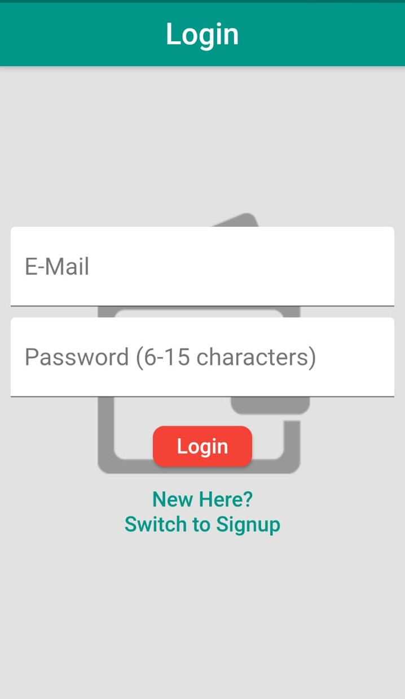
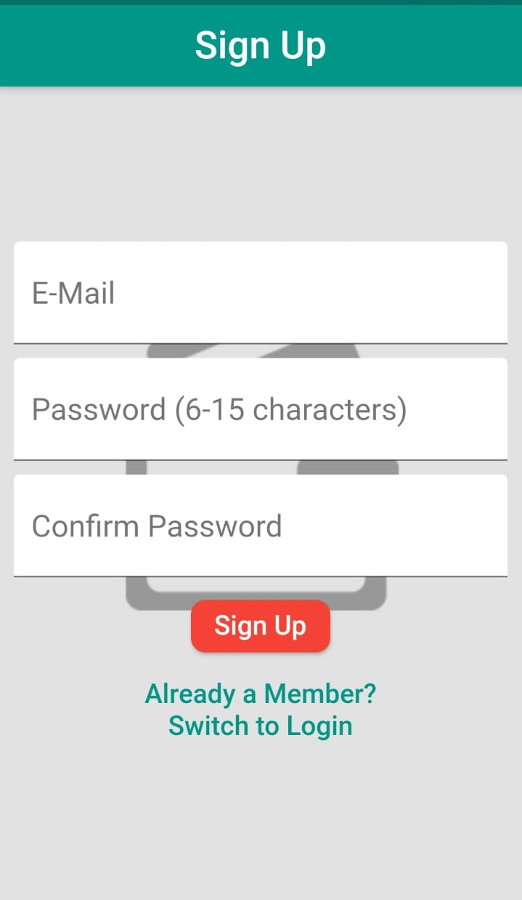
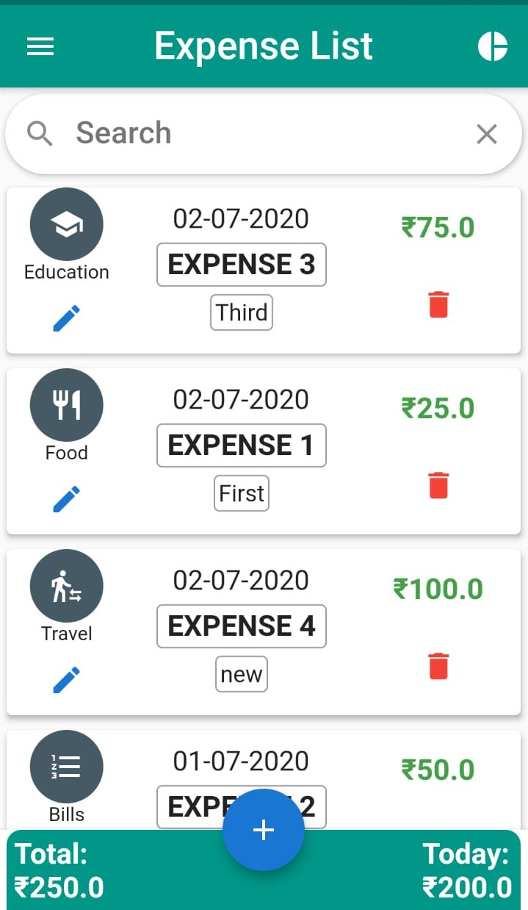
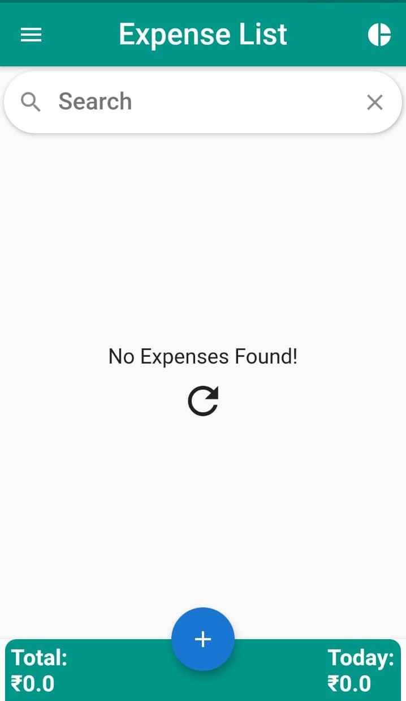
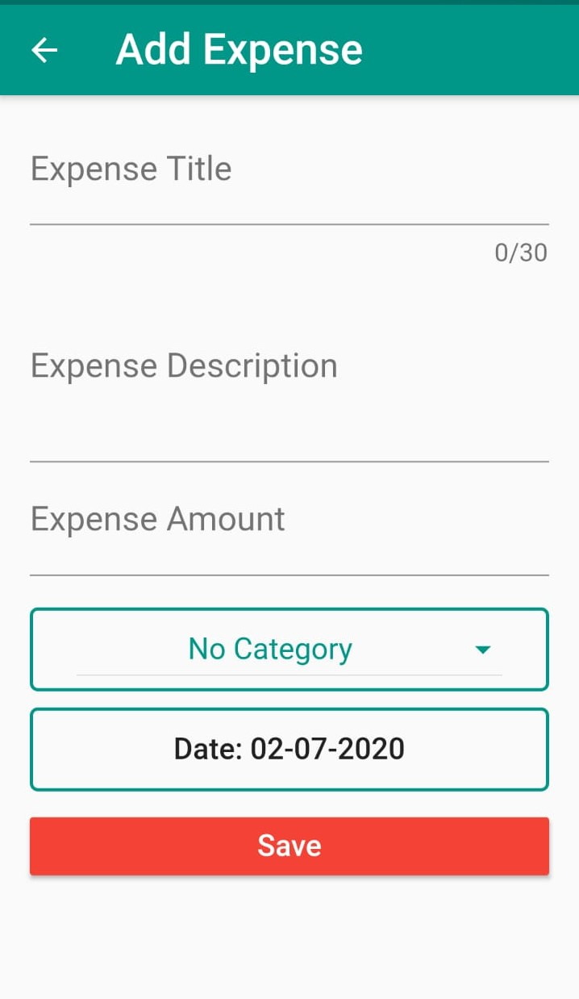
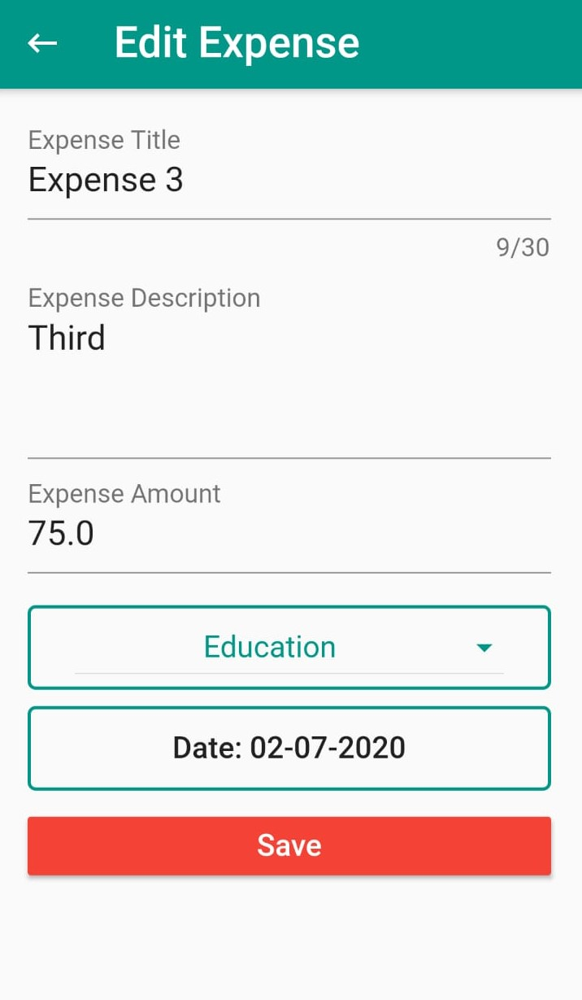
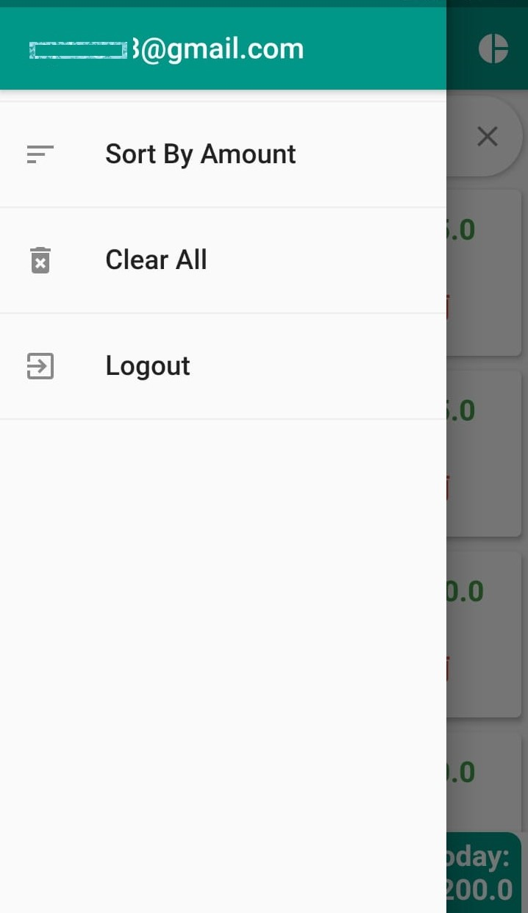
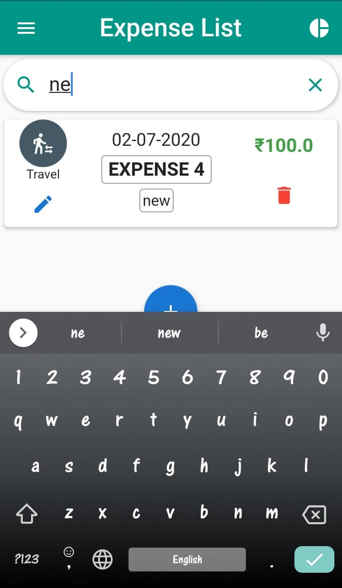
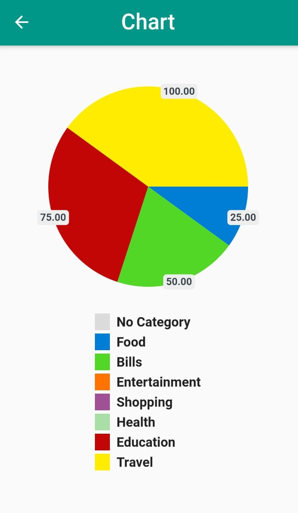

# Flutter-My-Expenses
 

An Expense Recorder App. Add, Update and Track your Daily Expenses.

## :briefcase: About Project

It is an Expense Recorder App made using Flutter and Firebase (for Database and Authentication). This app includes Email/Password Authentication.

### Features
#### 1) User Model

- User Authentication using Firebase
- Store Expenses to Firebase Realtime Database
- Logout User Anytime
- Auto Logout after 1 hour

#### 2) Expense Model

- Add, Update and Delete Expenses
- Fetch, Reload and Search Expenses
- Expense Total overall and current date
- Sort Expenses via date and amount
- Graphical representation of expenses via category


## :chart_with_upwards_trend: Workflow

#### 1) Login/ Sign Up
The App Starts with a Login Screen which has a switch button text for New Users to Sign Up. User can only Login or Sign Up with correct and valid credentials.

<p align="center">
  
  
</p>

#### 2) Home Screen/ Expense List
After the successful login/signup, User is navigated to the Home Screen which shows the existing expenses list if there are any. Swipe Down/Resfresh icon reloads the expense list.

The Bottom Bar shows the Total Expense and the currect day expenses of the User. The Expense Tile contains the information about the expense( Date Created, Amount, Title, Description, Category) and has two buttons for updating and deleting the expense. 

<p align="center">
  
  
</p>


#### 3) Add/Update Expense
The botton center floating buttons is used to add a new expense to the list. Title and Amount fields are required. Default category in No category and Default date is the current date.

The Expense Tile has the update button which leads to edit expense screen. This screen shows the exisitng values of the expense initially and all values can be updated.

<p align="center">
  
  
</p>

#### 4) Side Drawer
Side Drawer App Bar Shows the user email. It contains 3 tiles.

- Sort By Date/Amount - Sort expense data date/amount wise in descending order.
- Clear All - Delete all the expenses.
- Logout - Logout user and Navigate to Login page.

<p align="center">
  
</p>

#### 5) Search Expense
The search bar serches the current expense list for the input value. A expense can be searched by it's title and decription.

<p align="center">
  
</p>

#### 6) Chart
On the right side corner of the App Bar has a Pie Chart icon which shows the user expenses category wise using Pie Chart (animation enabled).

<p align="center">
  
</p>

## :gear: Build Process

### Requirements
* Requires the Flutter SDK to be installed. Instructions on how to setup your device for flutter development can be found at the [official flutter install guide](https://flutter.dev/docs/get-started/install)

#### 1) Setting up the Database.

1) Visit the [Firebase Console](https://console.firebase.google.com/) and create a new project.
2) Once your project is ready select `Database` under the `Develop` tab on the left hand side.
3) Scroll down and select the `create database` option under Realtime Database and hit enable. 
4) Select the rules tab on the database page and replace the code in the editor with:
```bash
{
  /* Visit https://firebase.google.com/docs/database/security to learn more about security rules. */
  "rules": {
    ".read": "auth!=null",
    ".write": "auth!=null"
  }
}
```

#### 2) Setting up Authentication.

1) From the main overview screen of your project select `Authentication` from the side menu.
2) Select the `Setup sign in method` option and then select `Email/Password` from the list of options.
3) Enable Email/Password sign in by pressing the button on the top right then hit save.

#### 3) Connecting Your App with Firebase.

1) Create a new Flutter Project and clone the Repository.
2) Go to the Firebase Project overview page. Select the little cog wheel next to project overview on the top left and click project settings.
3) Copy Your Project Id.
4) Go to your flutter project. Navigate to `lib/scoped-models/connected-expenses.dart` and replace all the `Your-Project-Id` with the Project Id you just copied.
```bash
https:// Your-Project-Id.firebaseio.com/expenses/${_authenticatedUser.id}.json?auth=${_authenticatedUser.token},
```
5) Go to the Firebase Project overview page. Select the little cog wheel next to project overview on the top left and click project settings.
6) Copy Your `Web Api Key`.
7) Go to your flutter project. Navigate to `lib/scoped-models/connected-expenses.dart` and replace all the `Your-Web-Api` with the Web Api Key you just copied.
```bash
'https://www.googleapis.com/identitytoolkit/v3/relyingparty/verifyPassword?key=Your-Web-Api',
```
#### 4) Building apk
1) Open a terminal at the root of the project.
2) Run `flutter build apk`.

